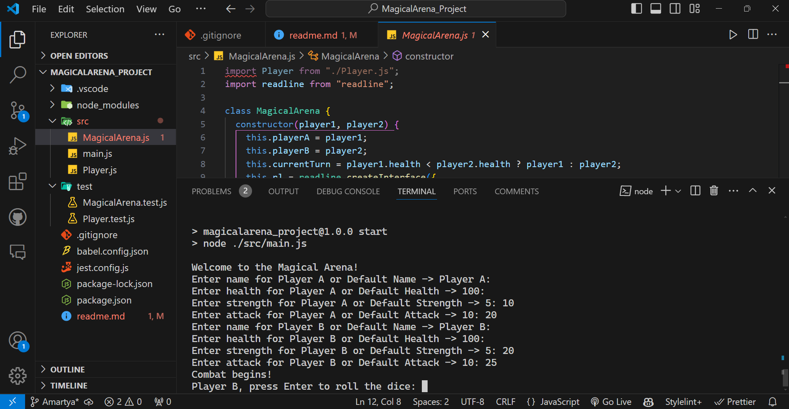
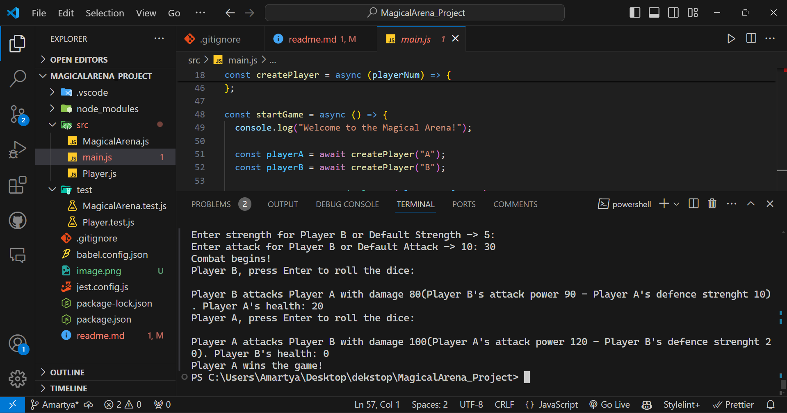
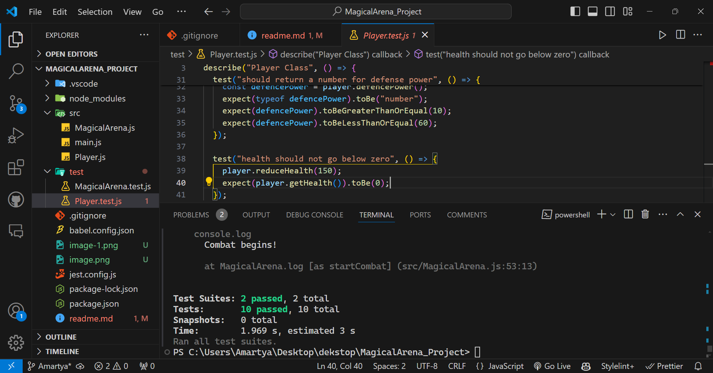

# Magical Arena

Magical Arena is a text-based combat simulation game where two players battle in a magical arena. Each player has attributes such as health, strength, and attack power. The game progresses turn-by-turn, where players attack each other until one of them is defeated.

## Approach

The Magical Arena project consists of two main classes: `Player` and `MagicalArena`.

### Player Class

The `Player` class defines the attributes and methods for a player in the game. Each player has:

- **name**: The name of the player.
- **health**: The health points of the player.
- **strength**: The strength of the player, affecting defense power.
- **attack**: The attack power of the player.

The `Player` class includes methods to get the player's health and name, reduce health when attacked, and calculate attack and defense power based on a dice roll.

### MagicalArena Class

The `MagicalArena` class manages the combat between two players. It includes:

- **playerA** and **playerB**: The two players in the arena.
- **currentTurn**: Keeps track of whose turn it is.
- **switchTurn**: Switches the turn between players.
- **playTurn**: Simulates a turn of combat where the current player attacks and the opponent defends.
- **askForRoll**: Prompts the current player to roll the dice to continue the game.
- **startCombat**: Initiates the combat by asking the first player to roll the dice.

The combat is turn-based, with each player taking turns to attack until one player's health drops to zero, resulting in the other player's victory.

### Dynamic Player Input

Users can dynamically enter the player's name, health points, strength, and attack power when starting the game. If no values are provided, default values will be used.

# Installation

1. Navigate to the project directory:
   cd MagicalArena

2. Install all necessary node modules:
   npm install

# Run Project

To start the project, run:
npm start

# Running Test Cases

To run the test cases, use:
npm test

This README file provides clear instructions for installing dependencies, running the project, and executing test cases.
